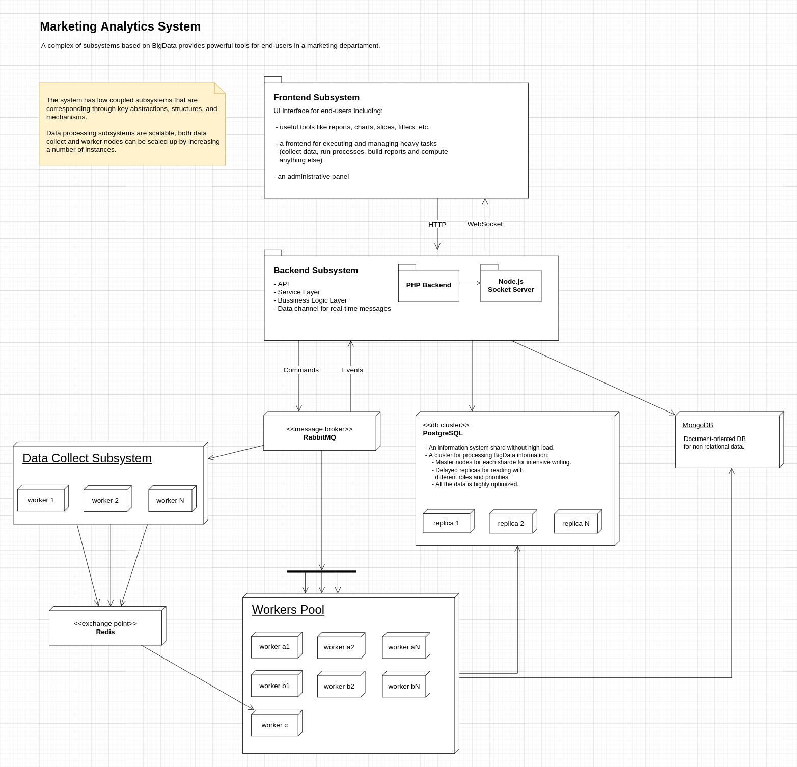
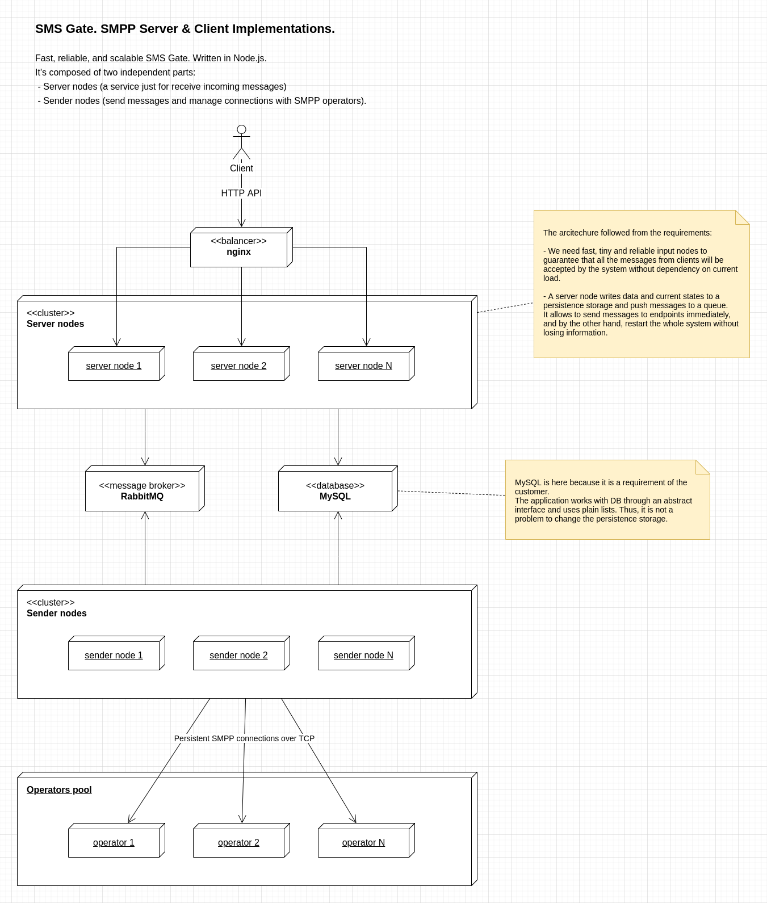
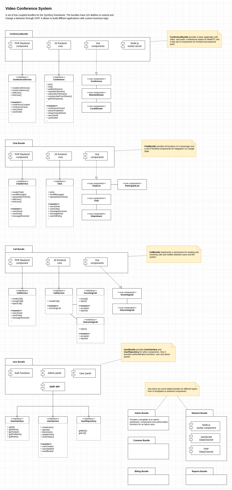
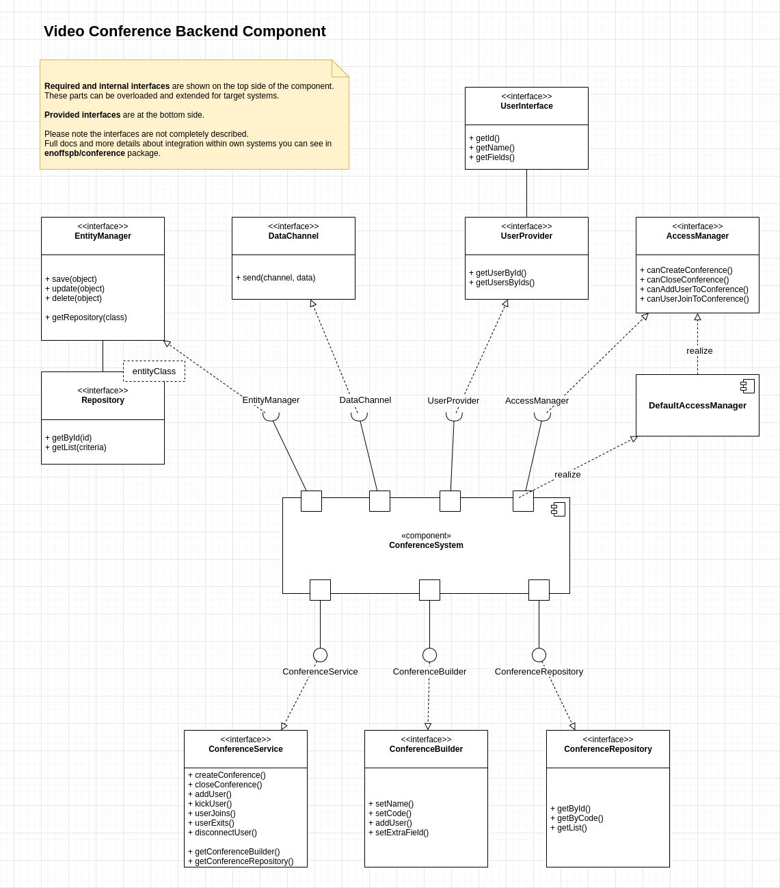
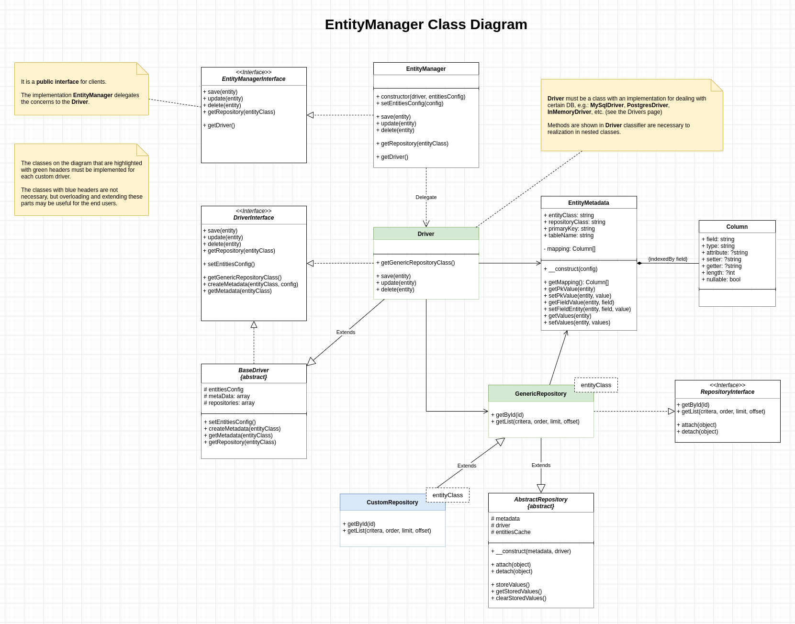
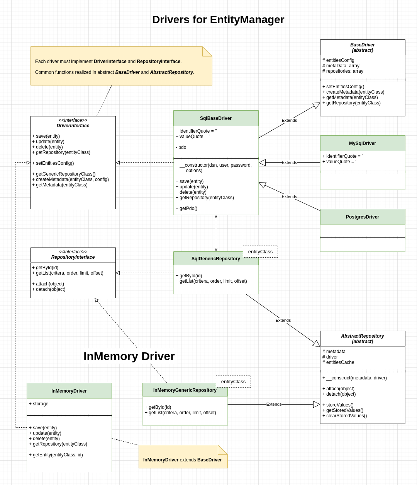
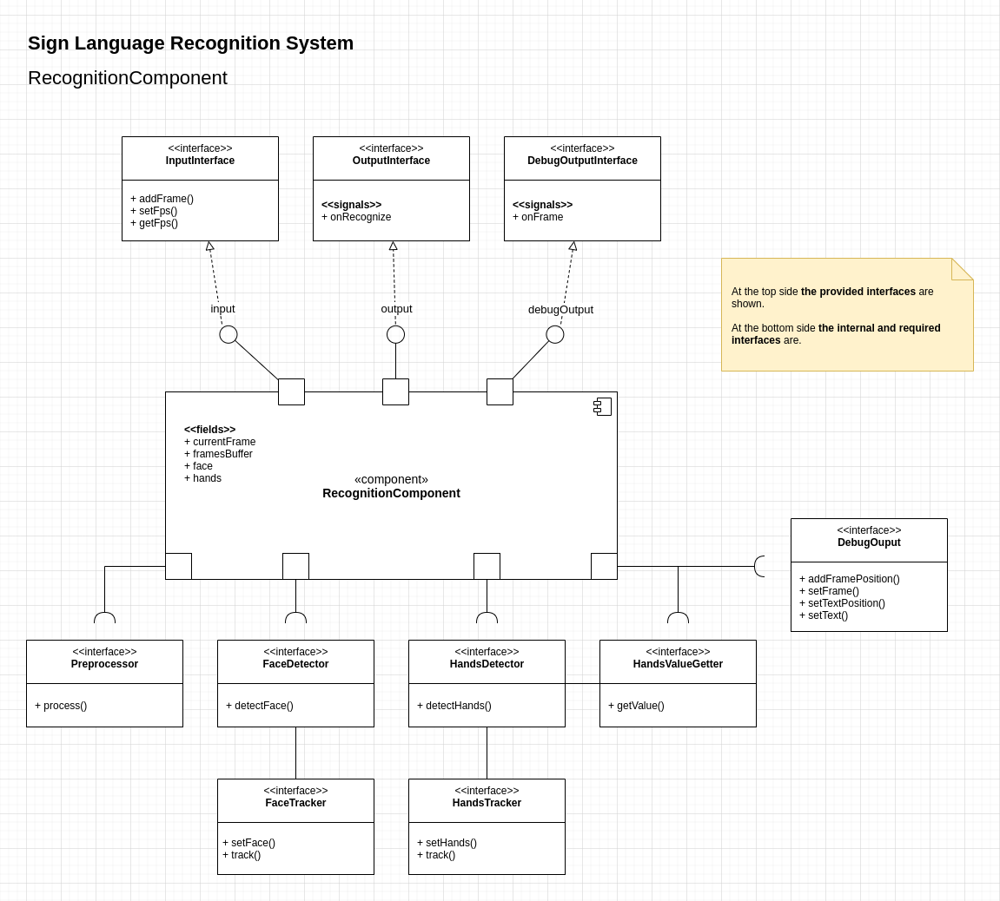

# Examples of systems and components

Here are some examples of system designs presented in UML diagrams.

Contents:
- [Marketing Analytics System](#marketing-analytics-system)
- [SMS Gate](#sms-gate)
- [Video Conference System](#video-conference-system)
- [Video Conference Backend Component](#video-conference-backend-component)
- [Entity Manager Component](#entity-manager-component)
- [Entity Manager Drivers](#drivers-for-entitymanager)
- [Sign Language Recognition System](#sign-language-recognition-system)

 

## Marketing Analytics System

 

## SMS Gate

 

## Video Conference System

 

## Video Conference Backend Component

 

## Entity Manager Component

 

## Drivers for EntityManager

 

## Sign Language Recognition System

The **RecognitionComponent** for the system. Read more at [a blog about developing Sign Language Recognition System](/slrs/).

