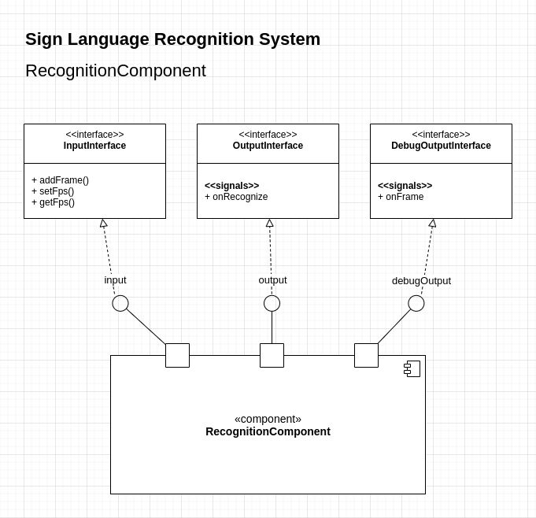

# Sign Language Recognition System

Hello everyone. It is a project about developing an AI system for recognition sign languages.
Also, it is a workbook about Object-Oriented Analysis and Design.
This project is based on the knowledge received at work in Surdo Online, IT-V LTD, with CEO - Alexey Melnik
and a programmer - Ilya Pastukhov, an author of that blog.
R&D has been completed with the support by national science programs and grants of Russia.

We won't talk about what is a sign language so much, you can find all the info on the web.
The important things for us are the following:
 - There are two modes of speaking: gestures and dactylemas.
 - A form of hand is an essential property.
 - Emotions and body moves are important too for semantic analysis, but not for early stages of development.
 - For distinct countries and regions languages are different.

And our scene likes this:

  
*the photo is from surdoserver.ru*

The main aspect of the suggested solution is an architecture of the system.
We are going to build a difficult complex system, thus, we need to use techniques and best practices
from OOAD and enterprise development. On the other hand, it may be just a combination of one modern NN
and a big dataset, but not in this case. We need to have a lot of control of a recognition process, we need to build stable intermediate releases step by step,
and we must give guarantees that our solution will be able to work in production in the future.

Let's start to decompose the system into high-level modules.
First, split the recognition process into two independent parts:
 - gesture recognition from a video source
 - semantic analysis of recognized data
 
We aren't considering semantic analysis right now, simply, it will be sign => word mapping.
Out target is recognition gestures from a video, let's call it **RecognitionComponent**.
Well, there is an input. Generally, it may be a remote real-time video, a webcam stream, or a file with a recorded video, but it is not a concern of the component.
Instead, we define a basic **InputInterface** like this (pseudocode):

```
interface InputInterface {
    addFrame(frame);
    setFps(fps);
    getFps();
}
```

Any external client can pass a video frame by frame to the component. Without set FPS an input is parsed as a real-time source,
otherwise, the component expects a video with static FPS.

Next, we need to get recognition results. It is a **OutputInterface**.
```
interface OutputInterface {
    onRecognize
}
```

The output returns a result in a defined format, at the start it will be like this:
```
struct RecognizedElement {
    int id, // or it may be "code", for example
    char* code
    
    // further there will be additional values and flags
}
```

And finally, we need an output video. There are some reasons:
- visualize a recognition process
- merge internal streams into one output
- add controls and text information
- make reports with results of testing for a control department

It will be a **DebugOutputInterface** with the following external interface:
```
interface DebugOutputInterface {
    onFrame
}
```
About its internal interface we'll talk later.

In a result we have defined clear boundaries of the component and have stated it with a UML diagram.

[](../diagrams/RecognitionComponent.1.drawio.png)


# Implementation of the RecognitionComponent

Let's discover an internal view of the component. We suggest an approach composed of a set of computer vision
and machine learning algorithms.

A computer vision part is the following:
 - The **Preprocessor** prepares a video stream, removes a noise, calibrates a frame, and so on.
 - The **FaceDetector** and the **FaceTracker**. By a face we set a system of coordinates for our scene.
 - The **HandsDetector** for detecting areas with hands.
 - The **HandsTracker** for tracking given objects.
 - The **HandsValueGetter** for extracting values from areas with hands.

In this way, we manually control all the objects and retrieve a result in a very approximate format.
In the easiest case a hand may be just a point with x,y coordinates and with a path presented as a curved line.
The data can be presented as a binary image or a sparse matrix which are suitable data structures for dealing with ML algorithms.
Further we need to describe hands by a value that characterizes a hand form. It is an integral image, for example.
However, it is a concern of the **HandsValueGetter** and a value is must be returned in a defined format.

Detector and tracker objects are different because their computer vision algorithms and approaches are different too.

A manager of the recognition process is the **RecognitionComponent** that deals with the described objects, puts a current frame and a buffer of frames to them, and invokes
methods of public interfaces.

The first iteration of analysis and design is complete. In the next chapter we are going to start implementation and continue the analysis and design phase.

[](../diagrams/RecognitionComponent.2.drawio.png)

